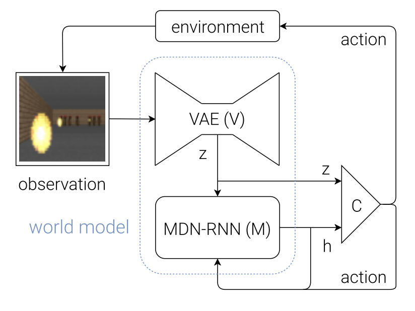

# 📄 World Models - The OG paper

## 📌 TL;DR
World Models (Ha & Schmidhuber, 2018) decomposes a reinforcement learning agent into three separate, largely independently trained modules — a Vision model (V), a Memory model (M), and a tiny Controller (C) — enabling an agent to train its policy entirely inside a "hallucinated dream" generated by its own learned world model and then transfer that policy back to the real environment. The official codebase, `hardmaru/WorldModelsExperiments`, implements this exact V-M-C pipeline in TensorFlow for the CarRacing-v0 and VizDoom: Take Cover environments, using a VAE, an MDN-RNN, and CMA-ES-evolved linear controllers that closely mirror every architectural detail described in the paper.




---

## 🔬 Research Overview & Core Problem

* **The Problem:** Model-free RL methods are fundamentally bottlenecked by the credit assignment problem, which forces practitioners toward small networks that iterate quickly at the cost of representational capacity. Prior to this work, there was no simple, scalable recipe for giving an RL agent a large, expressive predictive model of its environment while keeping the trainable policy small enough for credit assignment to remain tractable.
* **Key Contributions:**
  * Splits the agent into Vision (V), Memory (M), and Controller (C), trained mostly separately so most model capacity lives in V and M while C stays tiny.
  * Uses a Variational Autoencoder to compress each raw pixel frame into a small latent vector $z_t$.
  * Uses a Mixture Density Network RNN (MDN-RNN) to model the full distribution of future latent states rather than a single deterministic prediction.
  * Introduces a temperature parameter that controls the uncertainty of the generated "dream" environment, regularizing against the controller exploiting model imperfections.
  * Demonstrates that a controller trained entirely inside its own learned world model can transfer successfully back to the real environment.
  * Proposes a general iterative training loop for environments where a single random-policy rollout dataset is insufficient to bootstrap V and M.
* **Key Results:**
  * **CarRacing-v0:** The full world-model agent (using both $z_t$ and $h_t$) achieves an average score of 906 ± 21 over 100 trials — the first reported agent to solve this task, beating A3C (591–652) and the previous best leaderboard entry (838 ± 11).
  * **VizDoom: Take Cover:** An agent trained entirely inside its own dream (never observing a real frame during policy training) survives ~900 steps in the dream and ~1100 steps in the real environment, well above the 750-step solving threshold.
  * The Controller is deliberately tiny — only 867 parameters for CarRacing and 1,088 for VizDoom — compared to 4.3–4.4M parameters in the VAE and 422K–1.68M in the MDN-RNN.
  * Tuning the dream's temperature trades off realism against exploitability; a temperature of 1.15 gave the best real-environment transfer score of 1092 ± 556.

---

## 🏗️ Architecture Deep-Dive

* **High-Level Structure:**
  ```
  Raw pixel observation → V (VAE Encoder) → latent z_t
  (z_t, a_t, h_t) → M (MDN-RNN) → h_{t+1}, distribution over z_{t+1}
  (z_t, h_t) → C (linear Controller) → action a_t
  ```
  At each timestep, V encodes the current frame into $z_t$; C observes the concatenated vector $[z_t, h_t]$ and selects an action $a_t$; that action and $z_t$ feed into M, which updates its hidden state and outputs a distribution over the next latent state.

* **Novel Components:**
  * **V (Variational Autoencoder):** Compresses each 64×64px frame into a small latent vector ($z \in \mathbb{R}^{32}$ for CarRacing, $z \in \mathbb{R}^{64}$ for VizDoom) by minimizing reconstruction error plus a KL-divergence term against a standard Gaussian prior.
  * **M (MDN-RNN):** An LSTM whose output layer parameterizes a mixture-density network — the means, variances, and mixture weights of a Gaussian mixture over the next latent vector, rather than a single point estimate. For VizDoom, M additionally predicts a binary "done" signal, turning M into a fully self-contained virtual Gym environment.
  * **C (Controller):** A single linear layer mapping the concatenated vector $[z_t, h_t]$ directly to an action, trained with CMA-ES (an evolutionary strategy) rather than gradient descent, since it operates in a tiny (~1,000-parameter) search space well-suited to black-box optimization.
  * **Temperature parameter:** Controls sampling uncertainty in the MDN-RNN during dream rollouts. Low temperature collapses toward a near-deterministic LSTM (risking mode collapse — e.g., monsters that never throw fireballs), while high temperature makes the dream harder but produces controllers that transfer better to reality.

* **Loss Functions:**

  Controller action rule:

  ```math
  a_t = W_c [z_t, h_t] + b_c
  ```

  VAE loss (ELBO — reconstruction plus KL-divergence against a standard Gaussian prior):

  ```math
  \mathcal{L}_{VAE} = \mathbb{E}_{q(z \mid x)} \left[ \| x - \hat{x} \|^2 \right] + D_{KL} \left( q(z \mid x) \,\|\, \mathcal{N}(0, I) \right)
  ```

  MDN-RNN loss (negative log-likelihood of the true next latent under the predicted Gaussian mixture):

  ```math
  \mathcal{L}_{MDN} = - \log P(z_{t+1} \mid a_t, z_t, h_t)
  ```

  Controller objective (optimized via CMA-ES, not gradient descent, against cumulative episode reward $R$):

  ```math
  \max_{W_c, b_c} \; \mathbb{E} \left[ R(W_c, b_c) \right]
  ```

---

## 💡 Useful Bits & "The Secret Sauce"

* **The "Trick":** Rather than training one large end-to-end network, decouple representation learning (V), dynamics modeling (M), and decision-making (C), training each with the algorithm best suited to it — unsupervised VAE training for V, supervised sequence modeling for M, and evolutionary black-box optimization for the tiny C. This lets nearly all model capacity live in V and M (which need no reward signal at all) while keeping C's search space small enough for CMA-ES to solve efficiently.
* **Removed Heuristics:** No end-to-end backpropagation through the full agent is required, and no reward signal is needed to train either V or M. The paper also shows the controller doesn't need to explicitly plan or roll out hypothetical futures step-by-step; simply having access to M's hidden state — a compressed belief about the future — is enough to support reflexive, instinctive driving behavior.
* **Crucial Hyperparameters:**
  * **Temperature:** The single most important tunable parameter for training inside a dream — too low causes controller "cheating"/mode collapse, too high makes the dream too hard to learn from; a value of roughly 1.15 was optimal for VizDoom.
  * **Latent dimensionality of $z$:** 32 for CarRacing, 64 for VizDoom — large enough to capture task-relevant visual detail but small enough to keep M and C tractable.
  * **Training V and M separately, not end-to-end:** The paper notes joint end-to-end training is possible in principle, but training each model independently was more practical and required substantially less hyperparameter tuning.

---

## 💻 Codebase Mapping

* **Repository:** [https://github.com/hardmaru/WorldModelsExperiments](https://github.com/hardmaru/WorldModelsExperiments)
* **Tech Stack:** Python, TensorFlow (original 2018 implementation), NumPy, OpenAI Gym (requires the legacy `gym==0.9.4`; explicitly incompatible with `gym==0.10.x`), Jupyter Notebooks (a large share of the repository), and the `cma` Python package for CMA-ES-based controller optimization.
* **Theory-to-Code Map:**
  * **V (VAE):** Implemented in the `carracing/` and `doomrnn/` subdirectories via VAE-specific training scripts (e.g., `vae_train.py`) and a `vae/vae.py` module defining the encoder/decoder architecture and the reconstruction-plus-KL loss.
  * **M (MDN-RNN):** Implemented in `rnn_train.py` and an `rnn/rnn.py` module, defining the LSTM-based network with a mixture-density output head, trained via negative log-likelihood on rollout data pre-encoded by the trained VAE.
  * **C (Controller) + CMA-ES:** Implemented in `model.py` (the linear controller definition) and the evolutionary training driver (`train.py`, using the `cma` package), which runs parallel rollouts across multiple CPU cores and evolves the controller weights.
  * **Dream / Virtual Environment Wrapper:** For VizDoom, M is wrapped in a `gym.Env`-compatible interface inside the `doomrnn/` directory, matching the paper's description of wrapping a Gym interface over M so the controller can train entirely on hallucinated rollouts.
  * **Rollout / Data Collection:** Random-policy rollout collection scripts (e.g., `extract.py`) generate the initial ~10,000-episode dataset used to bootstrap V and M training, matching the paper's data-collection procedure.

---

## 🚀 Implementation Notes

* **Setup/Execution:**
  ```bash
  # Install legacy dependencies (critical version pin)
  pip install gym==0.9.4
  pip install numpy==1.13.3

  # Step-by-step pipeline (per repo README / accompanying blog post):
  python extract.py       # 1. collect random rollouts
  python vae_train.py     # 2. train VAE (V model)
  python series.py        # 3. encode rollout data into z using trained VAE
  python rnn_train.py     # 4. train MDN-RNN (M model)
  python train.py         # 5. evolve linear Controller (C model) via CMA-ES
  # 6. use provided test/eval scripts to evaluate the trained agent
  ```
* **Hardware Constraints:** The paper notes each individual model (VAE, MDN-RNN) required less than an hour of computation on a single GPU. The Controller's CMA-ES optimization runs on a single machine using multiple CPU cores in parallel to evaluate rollouts simultaneously; no GPU is needed for this stage.
* **Code vs. Paper Discrepancies:**
  * **Legacy dependency versions:** The repository only works with `gym==0.9.x` and explicitly fails on `gym==0.10.x`, reflecting its 2018 vintage. Modern users must pin old library versions or turn to unofficial reimplementations (e.g., a TensorFlow 2.2 port and newer PyTorch community ports), which are outside the scope of the official codebase covered here.
  * **Iterative training procedure (Section 5) not implemented for the main experiments:** The paper describes a general iterative loop — repeatedly rolling out, retraining M and C, and repeating — for more complex environments, demonstrated with a "Swing-up Pendulum from Pixels" example after 20 iterations. This generalized loop is discussed conceptually but not provided as a turnkey script; users must adapt the existing single-pass scripts manually to reproduce it.
  * **No official curiosity/reward-flipping module:** The paper's proposed extension of flipping the sign of M's loss to encourage curiosity-driven exploration is a suggested research direction, not an implemented feature in this repository.
  * **Interactive web demo is a separate project:** The browser-based interactive demos on worldmodels.github.io (VAE latent sliders, live dream-driving visualization) are implemented as a separate JavaScript/WebGL front-end and are not part of this Python training codebase.
